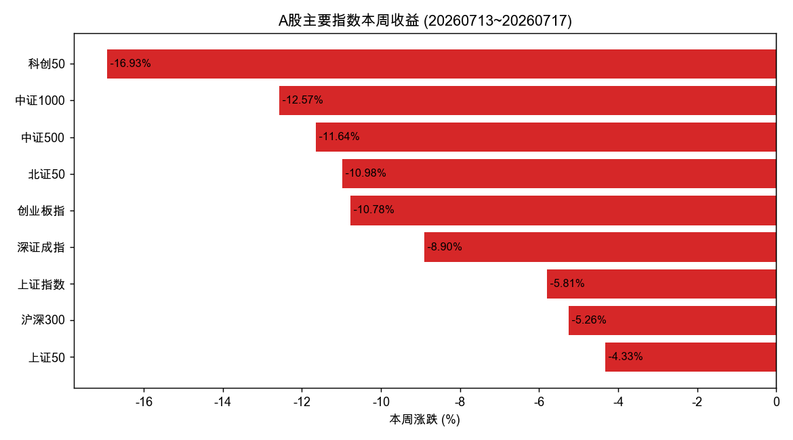
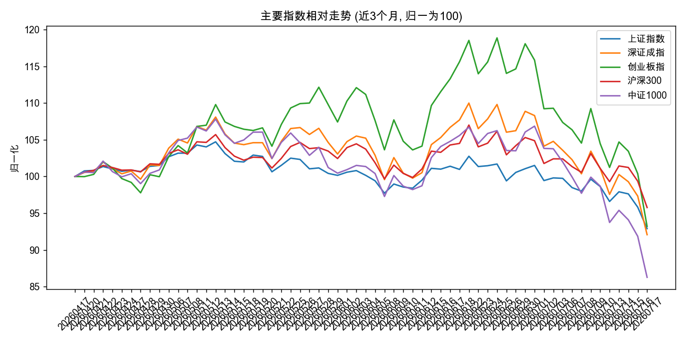
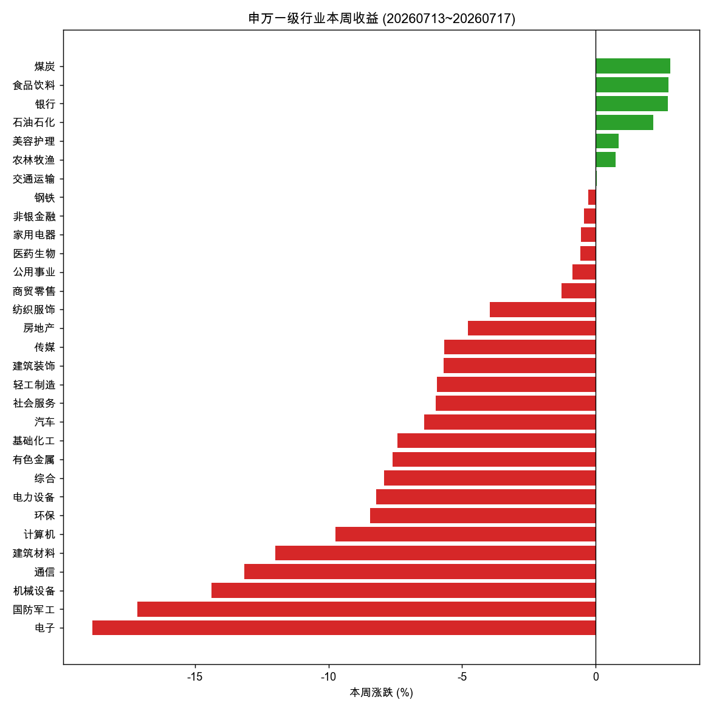
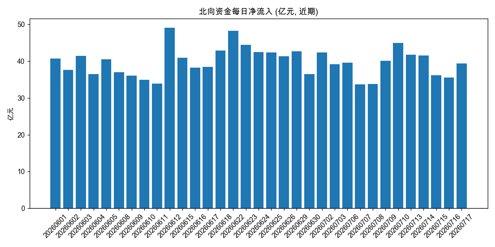
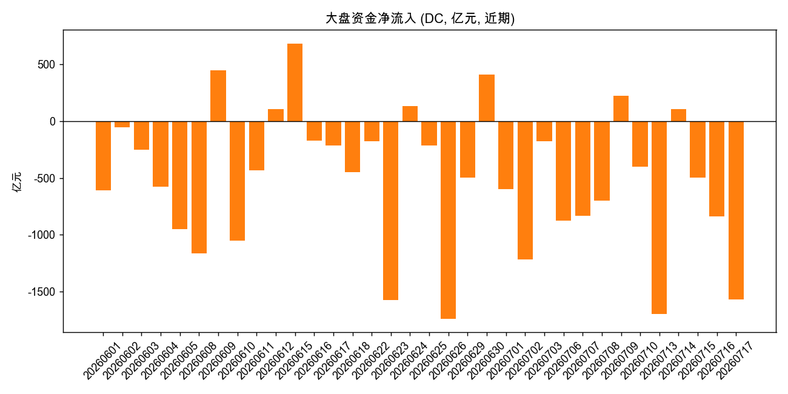

# A股市场周度快照 — 2026-07-13 至 2026-07-17

**编制日期**: 2026-07-18 (周六)
**数据截止**: 2026-07-17 收盘 (最后一个交易日)
**数据来源**: Tushare (index_daily / sw_daily / index_classify / index_dailybasic / moneyflow_hsgt / moneyflow_mkt_dc)
**本周交易日**: 07-13(一) / 07-14(二) / 07-15(三) / 07-16(四) / 07-17(五)

> 本文件为客观市场状态快照, 仅含事实与计算, 不含投资建议。根据用户要求，具体计划另行讨论。

---

## 一、核心结论 (事实层)

本周 A 股出现 **全面的、由成长向价值切换的剧烈调整**, 中小盘与科技板块是重灾区, 周五 (07-17) 为加速下跌日。

- **大盘普跌, 但风格分化极端**: 上证 50 仅跌 4.33%, 而科创 50 跌 16.93%、中证 1000 跌 12.57%、中证 500 跌 11.64%。大小盘裂口显著扩大。
- **行业呈典型避险轮动**: 煤炭 +2.79%、食品饮料 +2.72%、银行 +2.69%、石油石化 +2.15% 四大防御/红利板块逆势收涨; 而电子 -18.84%、国防军工 -17.15%、机械设备 -14.39%、通信 -13.14% 领跌。
- **周五加速**: 上证指数 07-17 单日 -3.05%, 创业板指 -7.15%, 科创 50 -7.12%, 全周低点收在最后一天, 未现明显企稳。
- **资金面分化**: 北向资金本周累计净流入约 **+194.5 亿元** (逆势买入), 而东方财富口径大盘资金累计净流出约 **-4495.5 亿元** (内资主力大幅撤离)。外资与内资方向背离, 是一个值得跟踪的信号。

---

## 二、主要指数本周表现

| 指数 | 收盘 | 本周涨跌 | 年初至今 |
|---|---:|---:|---:|
| 上证 50 | 2827.67 | **-4.33%** | -6.88% |
| 沪深 300 | 4529.10 | **-5.26%** | -2.63% |
| 上证指数 | 3764.15 | **-5.81%** | -5.07% |
| 深证成指 | 13706.88 | **-8.90%** | +0.76% |
| 创业板指 | 3428.63 | **-10.78%** | +5.73% |
| 北证 50 | 1076.38 | **-10.98%** | -25.80% |
| 中证 500 | 7513.76 | **-11.64%** | +0.74% |
| 中证 1000 | 7167.99 | **-12.57%** | -5.65% |
| 科创 50 | 1715.40 | **-16.93%** | +26.14% |

观察:
- 大盘蓝筹 (上证 50、沪深 300) 相对抗跌, 中小盘 (中证 500/1000) 与科技成长 (科创 50、创业板指) 重挫。
- 年初至今维度, 科创 50 仍有 +26.14% 的累计涨幅 (本周回吐较多), 北证 50 年内已跌 -25.80% 表现最弱。
- 走势上, 周二 (07-14) 曾有一次反弹, 但周三起连续下跌并于周五加速, 全周收盘在最低区域。

---

## 三、申万一级行业本周表现 (31 个)

**逆势收涨 (防御 + 红利 + 必需消费)**:
| 行业 | 本周 |
|---|---:|
| 煤炭 | +2.79% |
| 食品饮料 | +2.72% |
| 银行 | +2.69% |
| 石油石化 | +2.15% |
| 美容护理 | +0.86% |
| 农林牧渔 | +0.75% |

**跌幅靠前 (科技 + 中游制造 + 周期中游)**:
| 行业 | 本周 |
|---|---:|
| 电子 | -18.84% |
| 国防军工 | -17.15% |
| 机械设备 | -14.39% |
| 通信 | -13.14% |
| 建筑材料 | -11.98% |
| 计算机 | -9.74% |

完整 31 个行业排名见 `data/sector_weekly.csv`。行业收益分布明显双峰: 防御/红利端小幅正收益, 成长/制造端深度负收益, 中间地带 (医药、家电、公用事业等) 接近持平略跌。这是典型的 **risk-off + 风格切回大盘价值** 的特征。

---

## 四、资金面

### 北向资金 (沪深股通)
- 本周累计净流入 **+194.47 亿元**。
- 在市场大跌背景下北向仍为正, 与内资流出方向相反, 值得持续观察是否构成"聪明钱"信号。

### 大盘资金 (东方财富口径)
- 本周累计净流出约 **-4495.54 亿元**, 内资主力大幅撤离, 与中小盘重挫相互印证。

> 两个口径背离较大: 北向统计沪深股通成交净额, DC 大盘资金按大单/超大单净额估算, 口径不同, 不宜直接相加。但方向背离本身是有意义的市场结构信息。

---

## 五、估值与换手 (截至 07-17)

| 指数 | PE(TTM) | PB | 换手率(自由流通, %) |
|---|---:|---:|---:|
| 上证指数 | 16.09 | 1.42 | 3.47 |
| 深证成指 | 33.04 | 2.81 | 4.46 |
| 创业板指 | 43.74 | 5.83 | 5.53 |
| 上证 50 | 11.27 | 1.22 | 2.01 |
| 沪深 300 | 13.98 | 1.42 | 2.61 |
| 中证 500 | 35.50 | 2.39 | 4.25 |

- 创业板指 PE(TTM) 43.74 仍偏高, 但本周已较上周明显压缩 (因成分跌幅大); 上证 50 / 沪深 300 估值处于偏低区间。
- 中证 1000 / 科创 50 的 index_dailybasic 数据本周未返回 (接口覆盖范围限制), 如需可改用 daily_basic 聚合估算。

---

## 六、状态判断与下周观察要点 (客观项, 非建议)

**本周市场状态的关键特征**:
1. 单边下跌且收盘在低位, 周五加速, 短期技术面偏弱, 尚无企稳信号。
2. 风格极端切换: 大盘价值抗跌、成长科技领跌, 中小盘流动性压力大于大盘。
3. 资金结构背离: 北向净流入 vs 内资大单大幅净流出, 反映内外资对当前位置的判断分歧。

**下周值得跟踪的客观信号** (供制定计划时参考, 非投资建议):
- 上证指数 3764 一线能否企稳, 以及周五急跌后是否有情绪修复或继续探底。
- 北向资金流向是否延续净流入 (外资态度的持续性)。
- 科技/成长板块 (电子、半导体系、军工) 的跌势是否扩散或止稳。
- 防御/红利风格 (煤炭、银行、石油石化、食饮) 的相对强势是否延续。
- 成交量与换手变化 (本周恐慌放量还是缩量, 关系到下跌性质判断)。

---

## 七、复现性元数据

| 项 | 值 |
|---|---|
| 数据源 | Tushare Pro |
| 拉取时间 | 2026-07-18 |
| 数据截止日 (trade_date) | 2026-07-17 |
| 本周区间 | 2026-07-13 ~ 2026-07-17 |
| 上周末基准日 | 2026-07-10 |
| 年初基准日 | 2025-12-30 |
| 端点 | index_daily, sw_daily, index_classify(SW2021 L1), index_dailybasic, moneyflow_hsgt, moneyflow_mkt_dc |
| 标的 | 9 个主要指数 + 31 个申万一级行业 |
| 原始数据 | `data/indices_daily_raw.csv`, `data/sw_daily_raw.csv`, `data/sw_l1_classify.csv`, `data/index_dailybasic_raw.csv`, `data/moneyflow_hsgt_raw.csv`, `data/moneyflow_mkt_dc_raw.csv` |
| 计算口径 | 周收益 = close(07-17)/close(07-10)-1; YTD = close(07-17)/close(2025-12-30)-1; 北向累计 = Σnorth_money; DC 大盘累计 = Σnet_amount |
| 脚本 | `scripts/01_pull_indices.py`, `02_pull_sw_sectors.py`, `03_pull_flows_valuation.py`, `04_analyze.py` |
| 限制 | index_dailybasic 不覆盖科创 50 / 中证 1000; sw_daily 为 EOD; 资金流向两口径定义不同不可加总 |

---

*下一步: 在此快照基础上, 结合持仓与外部事件 (政策面/海外/产业), 讨论具体计划。*
